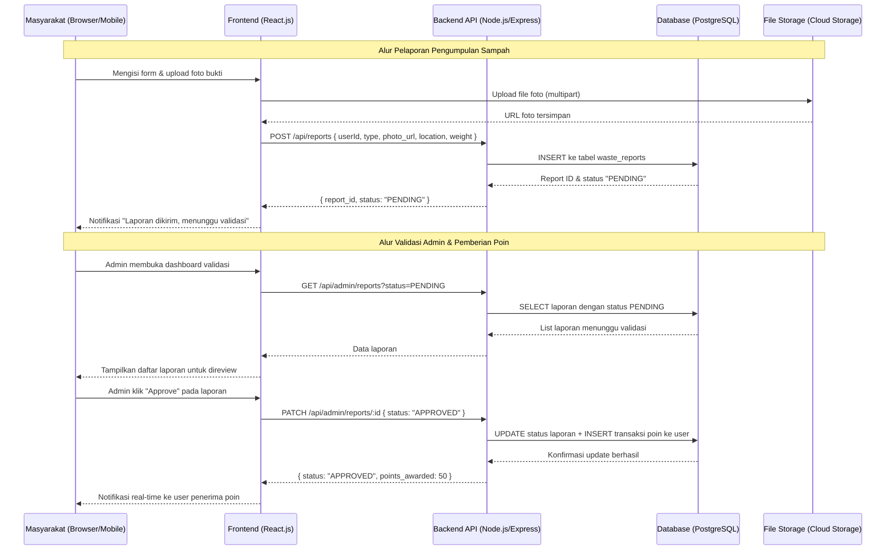
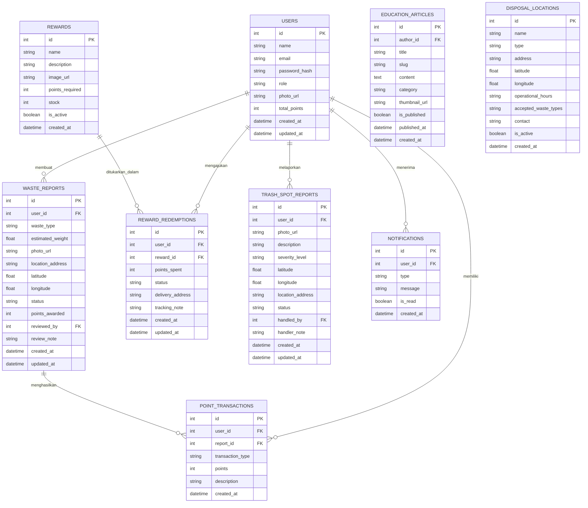

This is a [Next.js](https://nextjs.org) project bootstrapped with [`create-next-app`](https://nextjs.org/docs/app/api-reference/cli/create-next-app).

## Getting Started

First, run the development server:

```bash
npm run dev
# or
yarn dev
# or
pnpm dev
# or
bun dev
```

Open [http://localhost:3000](http://localhost:3000) with your browser to see the result.

You can start editing the page by modifying `app/page.tsx`. The page auto-updates as you edit the file.

This project uses [`next/font`](https://nextjs.org/docs/app/building-your-application/optimizing/fonts) to automatically optimize and load [Geist](https://vercel.com/font), a new font family for Vercel.

## Learn More

To learn more about Next.js, take a look at the following resources:

- [Next.js Documentation](https://nextjs.org/docs) - learn about Next.js features and API.
- [Learn Next.js](https://nextjs.org/learn) - an interactive Next.js tutorial.

You can check out [the Next.js GitHub repository](https://github.com/vercel/next.js) - your feedback and contributions are welcome!

## Deploy on Vercel

The easiest way to deploy your Next.js app is to use the [Vercel Platform](https://vercel.com/new?utm_medium=default-template&filter=next.js&utm_source=create-next-app&utm_campaign=create-next-app-readme) from the creators of Next.js.

Check out our [Next.js deployment documentation](https://nextjs.org/docs/app/building-your-application/deploying) for more details.

# PRD — Platform Digital Pengelolaan & Edukasi Sampah

## 1. Overview

Pengelolaan sampah di lingkungan sekitar masih menjadi tantangan besar yang belum terselesaikan secara optimal. Rendahnya kesadaran masyarakat dalam memilah dan membuang sampah pada tempatnya, dikombinasikan dengan kurangnya edukasi yang efektif dan berkelanjutan, menyebabkan penumpukan sampah yang tidak terkendali di berbagai titik lingkungan. Kondisi ini berdampak negatif terhadap kesehatan masyarakat, estetika lingkungan, serta keberlanjutan ekosistem secara keseluruhan.

Solusi yang diusulkan adalah membangun sebuah platform digital berbasis web yang berfungsi sebagai media pengelolaan dan edukasi sampah secara terintegrasi. Platform ini memungkinkan masyarakat untuk mendokumentasikan aktivitas pengumpulan sampah melalui unggahan foto, mendapatkan poin reward atas kontribusi mereka, menukarkan poin dengan hadiah menarik, serta mengakses konten edukasi mengenai jenis dan cara pengelolaan sampah yang benar. Selain itu, platform ini dilengkapi dengan fitur pelaporan titik sampah berbasis lokasi dan informasi lokasi pembuangan resmi.

Tujuan utama platform ini adalah meningkatkan partisipasi aktif masyarakat dalam pengelolaan sampah melalui pendekatan gamifikasi (poin & reward), membangun kesadaran lingkungan secara berkelanjutan melalui konten edukasi, serta menyediakan infrastruktur digital yang membantu pemerintah dan pengelola lingkungan dalam memantau dan menangani permasalahan sampah secara lebih terstruktur.

Pengguna platform ini mencakup tiga kelompok utama: **Masyarakat Umum** (warga yang ingin berkontribusi dalam pengelolaan sampah dan mendapatkan reward), **Admin/Pengelola** (pihak yang bertanggung jawab memvalidasi laporan, mengelola poin, dan mempublikasikan konten edukasi), serta **Petugas Lapangan** (yang merespons laporan titik sampah dan memperbarui status penanganan).

---

## 2. Requirements

Berikut adalah persyaratan tingkat tinggi untuk pengembangan sistem:

- **Aksesibilitas:** Platform harus dapat diakses melalui browser desktop dan mobile tanpa memerlukan instalasi aplikasi tambahan. Antarmuka wajib responsif dan mendukung pengguna dengan kemampuan teknis minimal.
- **Manajemen Pengguna:** Sistem harus mendukung registrasi dan autentikasi pengguna dengan minimal dua peran: Masyarakat (User) dan Admin. Pengguna dapat mengelola profil dan melihat riwayat aktivitas mereka.
- **Input Data & Dokumentasi:** Pengguna dapat mengunggah foto sebagai bukti pengumpulan sampah. Sistem harus memvalidasi format file (JPG, PNG) dengan batas ukuran maksimal 5MB per foto.
- **Sistem Poin & Reward:** Platform harus menghitung dan mencatat poin secara otomatis berdasarkan aktivitas pengguna yang telah divalidasi. Admin dapat mengonfigurasi nilai poin per aktivitas dan katalog reward yang tersedia untuk ditukarkan.
- **Pelaporan Berbasis Lokasi:** Fitur pelaporan titik sampah harus mengintegrasikan geolocation (GPS) untuk menentukan koordinat lokasi secara akurat. Setiap laporan wajib menyertakan foto dan deskripsi kondisi.
- **Notifikasi:** Sistem harus mengirimkan notifikasi in-app kepada pengguna saat laporan mereka divalidasi, poin diterima, atau status penukaran reward berubah.
- **Keamanan:** Seluruh komunikasi data wajib menggunakan HTTPS/TLS. Autentikasi menggunakan JWT (JSON Web Token) dengan masa berlaku yang dapat dikonfigurasi. Data sensitif pengguna harus dienkripsi saat disimpan.
- **Konten Edukasi:** Admin dapat membuat, mengedit, dan mempublikasikan artikel/modul edukasi tentang pengelolaan sampah. Pengguna dapat mengakses dan mencari konten berdasarkan kategori jenis sampah.

---

## 3. Core Features

Fitur-fitur kunci yang harus ada dalam versi pertama (MVP):

1. **Autentikasi & Manajemen Profil Pengguna**
   - Registrasi akun menggunakan email dan password
   - Login/logout dengan sesi aman berbasis JWT
   - Halaman profil menampilkan nama, foto profil, total poin, dan riwayat aktivitas
   - Reset password melalui email verifikasi

2. **Dokumentasi & Pengumpulan Sampah**
   - Form unggah foto bukti pengumpulan sampah (max 5MB, JPG/PNG)
   - Input metadata: jenis sampah, estimasi berat/jumlah, lokasi, dan catatan tambahan
   - Status validasi real-time: Menunggu Review → Divalidasi → Ditolak
   - Riwayat seluruh pengumpulan yang pernah disubmit

3. **Sistem Poin & Reward (Gamifikasi)**
   - Pemberian poin otomatis setelah laporan divalidasi oleh Admin
   - Dashboard poin pengguna dengan total akumulasi dan riwayat transaksi poin
   - Katalog reward yang dapat ditukarkan (voucher, merchandise, dll.)
   - Alur penukaran (redeem) reward beserta status pengiriman/penerimaan

4. **Pelaporan Titik Sampah Berbasis Lokasi**
   - Integrasi peta interaktif (Google Maps / Leaflet.js) untuk menandai lokasi penumpukan sampah
   - Form laporan: foto, deskripsi kondisi, kategori tingkat keparahan
   - Tracking status laporan: Dilaporkan → Dalam Penanganan → Selesai
   - Admin dan Petugas dapat memperbarui status dan menambahkan catatan penanganan

5. **Konten Edukasi**
   - Pustaka artikel dan panduan pengelolaan sampah berdasarkan kategori (organik, anorganik, B3, daur ulang)
   - Fitur pencarian dan filter konten berdasarkan tag/kategori
   - Admin panel untuk membuat dan mempublikasikan konten (WYSIWYG editor)
   - Halaman detail artikel dengan estimasi waktu baca dan navigasi antar artikel

6. **Informasi Lokasi Pembuangan Resmi**
   - Direktori lokasi TPS (Tempat Pembuangan Sementara) dan bank sampah resmi
   - Tampilan peta dengan marker lokasi pembuangan terdekat dari posisi pengguna
   - Detail setiap lokasi: alamat, jam operasional, jenis sampah yang diterima, kontak
   - Admin dapat menambah dan memperbarui data lokasi pembuangan

7. **Dashboard Admin**
   - Ringkasan statistik: total pengguna, laporan masuk, poin yang didistribusikan, reward yang ditukar
   - Manajemen validasi laporan pengumpulan sampah (approve/reject dengan komentar)
   - Manajemen pengguna, poin, dan katalog reward
   - Manajemen laporan titik sampah dan penugasan ke petugas lapangan

---

## 4. User Flow

Alur kerja sederhana bagi pengguna saat menggunakan aplikasi:

1. **Registrasi & Login:** Pengguna baru mengakses platform melalui browser, melakukan registrasi dengan email dan password, memverifikasi akun melalui email konfirmasi, lalu login ke dashboard personal.

2. **Dokumentasi Pengumpulan Sampah:** Pengguna memilih menu "Laporkan Sampah", mengisi form dengan mengunggah foto bukti, memilih jenis sampah, mengisi estimasi jumlah/berat, dan mengirimkan laporan untuk divalidasi.

3. **Proses Validasi Admin:** Admin menerima notifikasi laporan masuk, meninjau foto dan detail laporan, lalu memutuskan untuk menyetujui (Approve) atau menolak (Reject) dengan alasan yang jelas.

4. **Penerimaan Poin:** Jika laporan disetujui, sistem secara otomatis menambahkan poin ke saldo pengguna. Pengguna menerima notifikasi in-app dan dapat melihat pembaruan saldo di dashboard.

5. **Penukaran Reward:** Pengguna membuka halaman katalog reward, memilih reward yang diinginkan, mengonfirmasi penukaran jika saldo poin mencukupi, dan memantau status pengiriman reward melalui halaman riwayat redeem.

6. **Pelaporan Titik Sampah:** Pengguna menemukan penumpukan sampah, mengakses fitur "Laporkan Titik Sampah", menandai lokasi di peta, mengunggah foto kondisi, mengisi deskripsi, dan mengirimkan laporan kepada petugas.

7. **Mengakses Edukasi:** Pengguna mengunjungi halaman edukasi, menelusuri artikel berdasarkan kategori atau menggunakan fitur pencarian, membaca konten edukasi, dan mendapatkan pemahaman tentang cara pengelolaan sampah yang benar.

8. **Mencari Lokasi Pembuangan:** Pengguna mengakses fitur "Lokasi Pembuangan", mengizinkan akses lokasi pada browser, melihat marker TPS/bank sampah terdekat di peta, dan mengklik marker untuk detail informasi lokasi.

---

## 5. Architecture

Berikut adalah gambaran arsitektur sistem dan aliran data:



---

## 6. Database Schema

Berikut adalah Entity Relationship Diagram (ERD):



| Tabel                  | Deskripsi                                                                                             |
| ---------------------- | ----------------------------------------------------------------------------------------------------- |
| **USERS**              | Menyimpan data akun seluruh pengguna platform termasuk role (user/admin/petugas) dan total poin aktif |
| **WASTE_REPORTS**      | Laporan pengumpulan sampah yang disubmit pengguna beserta status validasi dan poin yang diberikan     |
| **POINT_TRANSACTIONS** | Riwayat seluruh transaksi poin (penambahan dari validasi laporan, pengurangan dari redeem reward)     |
| **REWARDS**            | Katalog reward/hadiah yang tersedia untuk ditukarkan oleh pengguna                                    |
| **REWARD_REDEMPTIONS** | Catatan penukaran reward yang diajukan pengguna beserta status pengiriman                             |
| **TRASH_SPOT_REPORTS** | Laporan titik penumpukan sampah dari masyarakat dengan koordinat GPS dan status penanganan            |
| **EDUCATION_ARTICLES** | Artikel dan konten edukasi tentang pengelolaan sampah yang dikelola oleh admin                        |
| **DISPOSAL_LOCATIONS** | Data lokasi TPS dan bank sampah resmi beserta informasi operasional                                   |
| **NOTIFICATIONS**      | Notifikasi in-app untuk setiap pengguna terkait aktivitas di platform                                 |

---

## 7. Design & Technical Constraints

Bagian ini mengatur batasan teknis dan panduan desain:

1. **High-Level Technology Stack:**
   Sistem dibangun menggunakan arsitektur **Full-Stack JavaScript** untuk mempercepat pengembangan dengan satu bahasa di sisi frontend dan backend. Frontend menggunakan **React.js** dengan **Tailwind CSS** untuk antarmuka yang responsif dan modern. Backend menggunakan **Node.js dengan Express.js** sebagai REST API server. Database menggunakan **PostgreSQL** karena kebutuhan relasional yang kompleks (poin, laporan, user, reward). File storage untuk foto menggunakan **Cloudinary** atau **AWS S3**. Integrasi peta menggunakan **Leaflet.js** (open-source) atau **Google Maps API**. Deployment menggunakan **Docker** untuk konsistensi environment, di-hosting di **Railway** atau **Render** (backend) dan **Vercel** (frontend).

2. **Typography Rules:**
   - **Sans (UI Utama):** `Inter, 'Noto Sans', system-ui, -apple-system, sans-serif`
   - **Serif (Konten Edukasi/Artikel):** `'Merriweather', 'Georgia', serif`
   - **Mono (Kode/Data Teknis):** `'JetBrains Mono', 'Fira Code', 'Courier New', monospace`

3. **Non-Functional Requirements:**
   - **Performa:** Waktu respons API kurang dari 500ms untuk endpoint standar. First Contentful Paint (FCP) halaman utama tidak lebih dari 2 detik pada koneksi 4G. Ukuran bundle JavaScript tidak melebihi 300KB (gzipped).
   - **Keamanan:** Autentikasi berbasis JWT dengan masa berlaku access token 1 jam dan refresh token 7 hari. Rate limiting pada endpoint login (max 5 percobaan per menit). Validasi dan sanitasi seluruh input pengguna di sisi server. Upload file dibatasi ukuran dan tipe MIME-nya.
   - **Skalabilitas:** Estimasi pengguna awal 500–2.000 pengguna aktif per bulan dengan potensi pertumbuhan 10x dalam 12 bulan. Database dikonfigurasi dengan connection pooling. Arsitektur stateless pada backend untuk memungkinkan horizontal scaling di masa mendatang.
   - **Ketersediaan:** Target uptime 99.5% per bulan. Database melakukan backup otomatis harian.

---

## Asumsi & Catatan

- Platform ini diasumsikan sebagai **aplikasi web** (bukan native mobile app) yang dapat diakses melalui browser smartphone untuk menjangkau pengguna lebih luas tanpa perlu instalasi.
- Proses validasi laporan pengumpulan sampah diasumsikan dilakukan **secara manual oleh Admin** melalui dashboard. Otomatisasi validasi berbasis AI (deteksi foto sampah) dapat dipertimbangkan di fase berikutnya.
- Sistem reward diasumsikan menggunakan **mekanisme manual** untuk fulfillment (Admin mengelola stok dan pengiriman). Integrasi dengan sistem e-commerce atau voucher digital dapat dikembangkan di fase lanjutan.
- Fitur pelaporan titik sampah diasumsikan memiliki alur penugasan sederhana: laporan masuk → Admin menugaskan ke Petugas → Petugas memperbarui status. Integrasi dengan sistem pemerintah daerah tidak termasuk dalam MVP.
- Notifikasi diasumsikan berupa **in-app notification** saja pada MVP. Notifikasi email dan push notification (PWA) dapat ditambahkan pada iterasi berikutnya.
- Bagian yang memerlukan klarifikasi lebih lanjut: mekanisme penghitungan poin per jenis sampah, kebijakan kadaluarsa poin, siapa yang bertanggung jawab menyediakan dan memperbarui data lokasi TPS resmi, serta anggaran untuk katalog reward awal.
